# Class diagram

```mermaid
classDiagram
    %% Enums
    class Suit {
        <<enum>>
        + HEARTS
        + DIAMONDS
        + CLUBS
        + SPADES
        + code: Int
        + symbol: String
    }

    class Rank {
        <<enum>>
        + TWO..ACE
        + value: Int
        + symbol: String
    }

    class PlayerStatus {
        <<enum>>
        + ACTIVE
        + FOLDED
        + ALL_IN
        + OUT
    }

    class Action {
        <<enum>>
        + FOLD
        + CHECK
        + CALL
        + BET
        + RAISE
        + ALL_IN
    }

    class GamePhase {
        <<enum>>
        + WAITING
        + PREFLOP
        + FLOP
        + TURN
        + RIVER
        + SHOWDOWN
    }

    class Combination {
        <<enum>>
        + HIGH_CARD(1)
        + ONE_PAIR(2)
        + TWO_PAIR(3)
        + THREE_OF_A_KIND(4)
        + STRAIGHT(5)
        + FLUSH(6)
        + FULL_HOUSE(7)
        + FOUR_OF_A_KIND(8)
        + STRAIGHT_FLUSH(9)
        + ROYAL_FLUSH(10)
        + value: Int
    }

    %% Core domain classes
    class Card {
        + suit: Suit
        + rank: Rank
        + toString(): String
    }

    class Deck {
        - cards: MutableList~Card~
        + shuffle() Unit
        + draw() Card
        + reset() Unit
    }

    class Player {
        - id: UUID
        + name: String
        - stack: Int
        - hole: MutableList~Card~
        - status: PlayerStatus
        + getId() UUID
        + getStack() Int
        + getStatus() PlayerStatus
        + getHole() List~Card~
        + receiveCard(c: Card) Unit
        + clearHole() Unit
        + bet(amount: Int) Int
        + setStack(value: Int) Unit
        + setStatus(value: PlayerStatus) Unit
    }

    class Pot {
        - total: Int
        - contributions: MutableMap~Player, Int~
        - sidePots: MutableList~SidePot~
        + add(player: Player, amount: Int) Unit
        + getTotal() Int
        + getContributions() Map~Player, Int~
        + getSidePots() List~SidePot~
        + buildSidePots(players: List~Player~) Unit
        + distributeWinners(winners: List~Player~) Map~Player, Int~
        + reset() Unit
    }

    class SidePot {
        + eligiblePlayers: MutableSet~Player~
        + amount: Int
    }

    class Hand {
        - id: UUID
        - players: MutableList~Player~
        - pot: Pot
        - deck: Deck
        - community: MutableList~Card~
        - currentBet: Int
        - dealerIndex: Int
        - currentPlayerIndex: Int
        - endedEarly: Boolean
        + phase: GamePhase
        + getId() UUID
        + getPlayers() List~Player~
        + getCommunity() List~Card~
        + getPot() Pot
        + getCurrentBet() Int
        + setCurrentBet(bet: Int) Unit
        + getDealerIndex() Int
        + getCurrentPlayerIndex() Int
        + setCurrentPlayerIndex(index: Int) Unit
        + isEndedEarly() Boolean
        + dealHole() Unit
        + dealFlop() Unit
        + dealTurn() Unit
        + dealRiver() Unit
        + addCommunityCard(card: Card) Unit
        + showdown() List~Player~
        + endHandEarly(winner: Player?) Unit
        + reset() Unit
    }

    class Game {
        - id: UUID
        - players: MutableList~Player~
        - currentHand: Hand?
        - currentBet: Int
        + getId() UUID
        + getPlayers() List~Player~
        + getCurrentHand() Hand?
        + getCurrentHandOrThrow() Hand
        + getCurrentBet() Int
        + setCurrentBet(bet: Int) Unit
        + isHandInProgress() Boolean
        + addPlayer(p: Player) Unit
        + removePlayer(p: Player) Unit
        + startHand() Hand
        + clearHand() Unit
    }

    class ActionProcessor {
        - logger: Logger
        + validate(player: Player, action: Action, amount: Int, hand: Hand) Boolean
        + execute(hand: Hand, player: Player, action: Action, amount: Int) Boolean
    }

    class HandEvaluator {
        + bestHand(player: Player, community: List~Card~) HandRank
        + compare(hand1: HandRank, hand2: HandRank) Int
        - detectCombination(cards: List~Card~) Combination
    }

    class HandRank {
        + category: Int
        + cards: List~Card~
        + compareTo(other: HandRank) Int
        + equals(other: Any?) Boolean
        + hashCode() Int
    }

    %% Interfaces
    class Logger {
        <<interface>>
        + info(msg: String) Unit
        + error(msg: String) Unit
    }

    class Storage {
        <<interface>>
        + saveGame(g: Game) Unit
        + loadGame(id: UUID) Game?
    }

    class View {
        <<interface>>
        + printWelcome() Unit
        + printGameInfo(game: Game) Unit
        + printBlindsConfigured(smallBlind: Int, bigBlind: Int) Unit
        + printPlayerSetupHeader(playerNumber: Int) Unit
        + printError(msg: String) Unit
        + printMessage(msg: String) Unit
        + printPlayerOrder(players: List~Player~, dealerIndex: Int, sbIndex: Int, bbIndex: Int) Unit
        + printAllPlayersStatus(players: List~Player~) Unit
        + printHandInfo(hand: Hand) Unit
        + dealFlop() Unit
        + dealTurn() Unit
        + dealRiver() Unit
        + printBettingRoundStart(startingPlayer: Player) Unit
        + printBettingRoundComplete() Unit
        + printPlayerTurn(player: Player, isDealer: Boolean) Unit
        + printAvailableActions(hand: Hand, player: Player) Unit
        + printToCall(amount: Int) Unit
        + printInvalidAction() Unit
        + printOnlyOnePlayerLeft() Unit
        + printAllPlayersFolded() Unit
        + readAction(hand: Hand, player: Player) Action
        + readBetAmount(prompt: String, minRaise: Int) Int
        + readPositiveInt(prompt: String, default: Int) Int
        + readBlindAmount(blindType: String, default: Int) Int
        + readPlayerName() String
        + askAddPlayer() Boolean
        + askNewHand() Boolean
        + printShowdownStart() Unit
        + printCommunityCards(cards: List~Card~) Unit
        + printHandRank(player: Player, rank: HandRank) Unit
        + printWinners(winners: List~Player~) Unit
        + printGameSaved() Unit
        + printGameLoaded() Unit
        + printGameEnded() Unit
        + printGameAlreadyEnded() Unit
        + printPlayerStatus(player: Player) Unit
    }

    %% Implementations
    class ConsoleLogger {
        + info(msg: String) Unit
        + error(msg: String) Unit
    }

    class FileStorage {
        - basePath: String
        - logger: Logger
        + saveGame(g: Game) Unit
        + loadGame(id: UUID) Game?
    }

    class ViewCli {
        - scanner: Scanner
        - logger: Logger
        + printWelcome() Unit
        + printGameInfo(game: Game) Unit
        + ... (все методы View)
    }

    class Controller {
        - storage: Storage
        - logger: Logger
        - view: View
        - actionProcessor: ActionProcessor
        - game: Game?
        - bigBlind: Int
        - smallBlind: Int
        + startGame() Unit
        + startHand() Unit
        + playerAction(player: Player, action: Action, amount: Int) Unit
        + getGame() Game?
        + setGame(g: Game) Unit
        + saveGame() Unit
        + loadGame(id: UUID) Unit
        - isGameEnded() Boolean
        - placeBlind(player: Player, amount: Int, hand: Hand) Unit
        - findFirstActive(hand: Hand, startIndex: Int) Int
        - runBettingRound(hand: Hand, startingPlayerIndex: Int, isPreFlop: Boolean) Boolean
        - handleShowdown(hand: Hand) Unit
    }

    %% Relationships
    Game o-- Player : contains
    Game --> Hand : creates/currentHand
    Hand o-- Player : contains (references from Game)
    Hand o-- Pot : tracks
    Hand o-- Deck : uses
    Hand ..> HandEvaluator : evaluates
    Controller o-- Game : controls
    Controller o-- View : uses
    Controller o-- Storage : uses
    Controller o-- ActionProcessor : uses
    Controller o-- Logger : uses
    ActionProcessor ..> Hand : modifies
    ActionProcessor ..> Pot : updates
    ActionProcessor ..> Logger : logs
    ViewCli --|> View : implements
    ConsoleLogger --|> Logger : implements
    FileStorage --|> Storage : implements
```

## Слои архитектуры

### Domain Layer (Ядро игры)
- **Card**, **Deck** - карты и колода
- **Player** - игрок (стек, карты, статус)
- **Pot** - банк с поддержкой side pots
- **Hand** - раздача (управляет фазами, картами, игроками)
- **Game** - игра/стол (список игроков, текущая раздача)
- **HandEvaluator**, **HandRank** - оценка комбинаций
- **Enums** (Suit, Rank, PlayerStatus, Action, GamePhase, Combination)

### Infrastructure Layer
- **ActionProcessor** - валидация и выполнение действий игроков
- **Logger** (interface), **ConsoleLogger** - логирование
- **Storage** (interface), **FileStorage** - сохранение/загрузка игр (Java serialization)

### Application Layer
- **Controller** - координация игрового процесса, MVC контроллер

### Presentation Layer
- **View** (interface) - контракт для отображения
- **ViewCli** - консольная реализация
- **ViewGui** - GUI реализация (JetBrains Compose Multiplatform)

## Паттерны

- **MVC**: Controller координирует, View отображает, Model (Game/Hand/Player) хранит данные
- **Strategy**: View interface с разными реализациями (CLI/GUI)
- **Dependency Injection**: Controller получает зависимости через конструктор
- **Repository**: Storage interface для доступа к сохранённым играм
